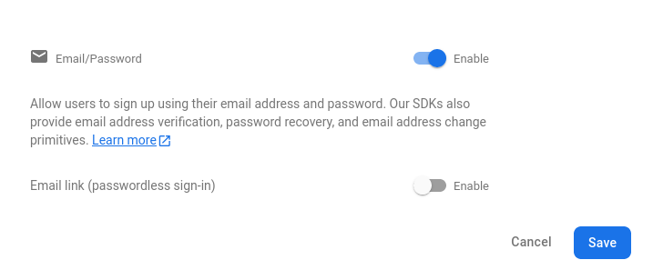
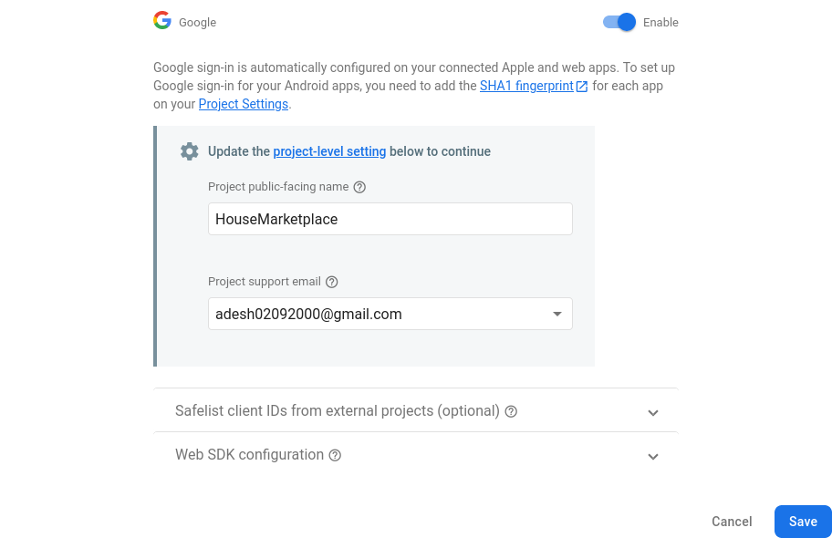
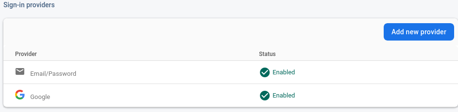
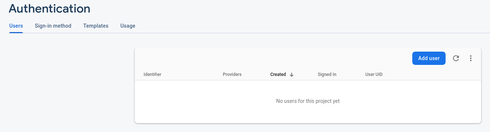
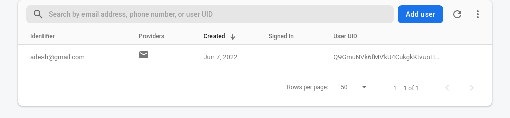
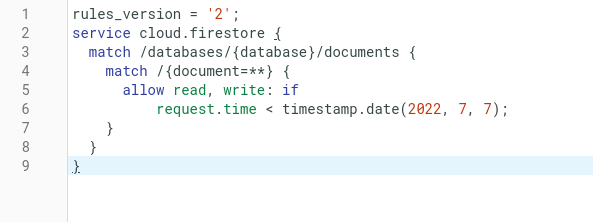
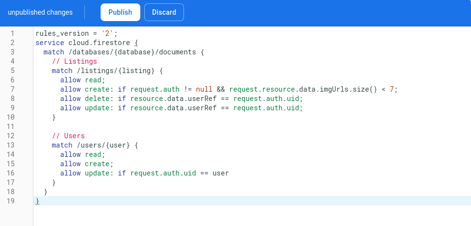
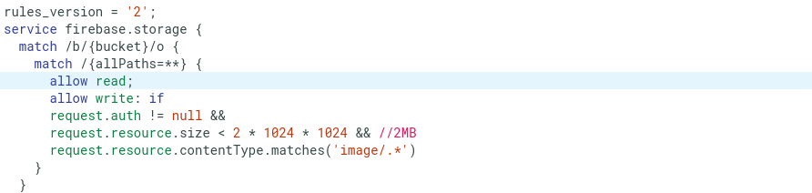
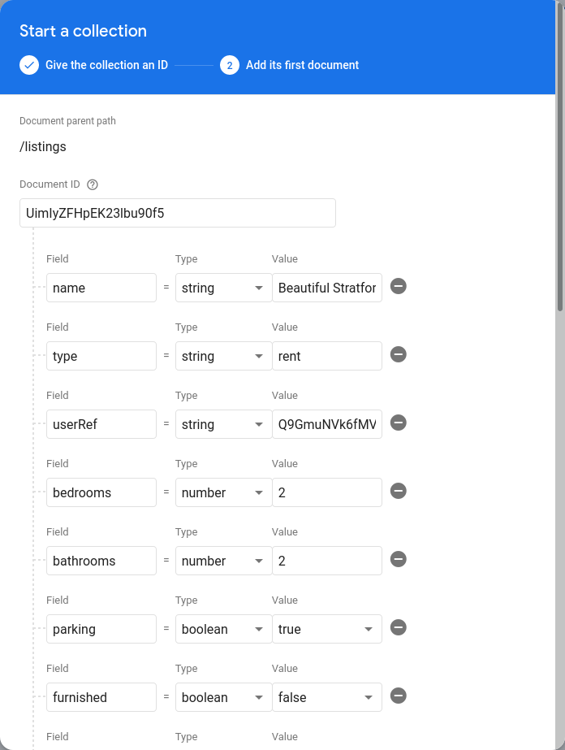
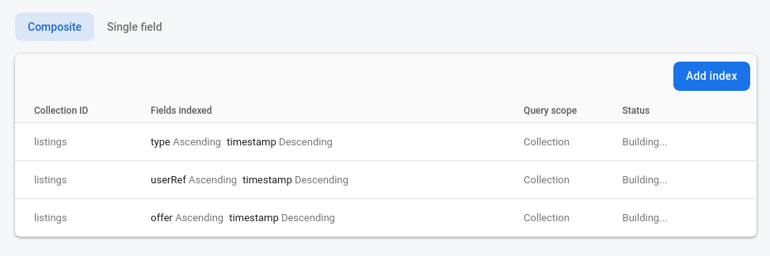

# House Market Place (React + Firebase)

We will use Firebase for database + file storage + authentication.
We won't need to use any kind of context API or state manager since Firebase is modular and we can fetch things from there as we need.

### Setting up Firebase

- [x] Create a new firebase project

- [x]  Create "web" app within firebase to get config values"

- [x] Install firebase

  ```shell
  npm i firebase
  ```

- [x] Create a new file `firebase.config.js` and paste the config values : 
  ```js
  import { initializeApp } from "firebase/app";
  const firebaseConfig = {
    apiKey: <API_KEY>,
    authDomain: <AUTH_DOMAIN>,
    projectId: <Project_ID>,
    storageBucket: <Storage_bucket>,
    messagingSenderId: <MessageSenderID>,
    appId: <appID>
  };
  
  // Initialize Firebase
  const app = initializeApp(firebaseConfig);
  ```

  Now since we need to `firestore` SDK we will import it now : 
  ```js
  import { initializeApp } from 'firebase/app'
  // import the firestore SDK
  import { getFirestore } from 'firebase/firestore'
  
  const firebaseConfig = {
    apiKey: <API_KEY>,
    authDomain: <AUTH_DOMAIN>,
    projectId: <Project_ID>,
    storageBucket: <Storage_bucket>,
    messagingSenderId: <MessageSenderID>,
    appId: <appID>
  };
  
  const app = initializeApp(firebaseConfig)
  // export the firestore databse
  export const db = getFirestore()
  ```

- [x] Enable authentication for email/password and Google, (we'll add it in the app later on)
  Go to the authentication section and enable email/password and google

  

  In case of google, add you own custom public facing name (this will appear when the user signs in)





- [x] Create a firebase user : 
  From sign-in methods go to users tab : 

  



- [x] Enable `Firestore`
  Use the test mode for now and set the location to be southeast asia

- [x] Create auth rules : 
  The rules are written in Common expression language (`CEL`), and right now it says that anyone can read and write the database of next 30 days

  

  Change it to this instead  :
  

Which says that anyone can read the listings but to create you need to log in, and no more than 6 images are allowed per listing. For deleting and updating the listings too you need to log in and the listing should be yours

Also for the users collection, allow read and create to anyone, but only allow update to the authenticated users

- [x] Add Storage Rules : 
  Currently the rules allows read and write to any authenticated user. But we want to change it to this : 

  

Can write only if authenticated and the image size must be less than 2MB

- [ ] Create the listing collection and add a dummy document into it.
  ```json
  // sample listing
  {
  	"listings": [
  		{
  			"name": "Beautiful Stratford Condo",
  			"type": "rent",
  			"userRef": "ID OF A USER", // while submitting the listing we add the userRef from the code
  			"bedrooms": 2,
  			"bathrooms": 2,
  			"parking": true,
  			"furnished": true,
  			"offer": true,
  			"regularPrice": 2500,
  			"discountedPrice": 2000,
  			"location": "8601 West Peachtree St Stratford, CT 06614",
  			"geolocation": {
  				"lat": "41.205590",
  				"lng": "-73.150530"
  			},
  			"imageUrls": [],
  			"timestamp": "00:00:00"
  		},
  }
  ```

  

- [ ] Add some composite indexes for (type, timestamp, `userRef`, offer), we do this since we need to make queries that match across multiple fields

  **First Index**

- Collection: Listings

- Query Scope: Collection

| Field     |            |
| --------- | ---------- |
| type      | Ascending  |
| timestamp | Descending |

**Second Index**

- Collection: Listings
- Query Scope: Collection

| Field     |            |
| --------- | ---------- |
| userRef   | Ascending  |
| timestamp | Descending |

**Third Index**

- Collection: Listings
- Query Scope: Collection

| Field     |            |
| --------- | ---------- |
| offer     | Ascending  |
| timestamp | Descending |



Here we are making the indexes manually but when we run our query in our app code we get a link for generating the required index. (which is the recommended way)

:heavy_check_mark: Firebase setup done.

### The Plan ahead

Next let's create a basic layout for the pages like Explore, offers, sign up and so on. (Only layout no logic)
Then we'll tackle the sign in and sign up feature with email or google, also the forget password feature.
And then we will move to actual logic of listing the houses

Creating of pages and routes done.

Put the `Navbar` inside the `<Router>`, since we are going to use hooks like `useNavigate`

```jsx
import { ReactComponent as OfferIcon } from '../assets/svg/localOfferIcon.svg'
```

This syntax works in create-react-app, since it uses `svgr` under the hood. But to use it with the vite build, we need to install the `svgr` plugin for vite.

#### Firebase Authentication and Profiles

Now that we have our sign in and sign up pages setup. First we will sign them up (and get them authenticated) and then later we will add them to the users collection.

Use this link for sign up : https://firebase.google.com/docs/auth/web/start#web-version-9_1

Now we'll add the user that we received from the `createUserWithEmailAndPassword` function to the `firestore` collection called `users`

Use this for docs : https://firebase.google.com/docs/firestore/manage-data/add-data#web-version-9

### Using the cool React `Toastify` package for alerts

https://fkhadra.github.io/react-toastify/installation

```jsx
  import React from 'react';
  // Bring in the ToastContainer and the css in App.js
  import { ToastContainer, toast } from 'react-toastify';

  import 'react-toastify/dist/ReactToastify.css';
  // import 'react-toastify/dist/ReactToastify.min.css';

  function App(){
    const notify = () => toast("Wow so easy !");

    return (
      <div>
        <button onClick={notify}>Notify !</button>
        	{/* Add the ToastContainer to App.js and then you can call the toast function where ever you want the alerts */}
            <ToastContainer />
      </div>
    );
  }
```

### Checking the logged in status of users in firebase

We'll create a custom hook to do this, we'll also use a `firebase/auth` function `onAuthStateChanged` which fires whenever the logging state changes (logged in to log out or vice-versa)

The `onAuthStateChanged` function takes the `auth` variable and a function that gives the user status

https://stackoverflow.com/questions/65505665/protected-route-with-firebase 

### Google `OAuth`

With the forgot password functionality done, all that is left is google `Oauth` in the authentication part. Let's tackle it in this commit

With the firebase authentication done, we now can work on the main listings part of the project

### Get & Create Listings

##### Uploading images to firebase

https://firebase.google.com/docs/storage/web/upload-files#monitor_upload_progress